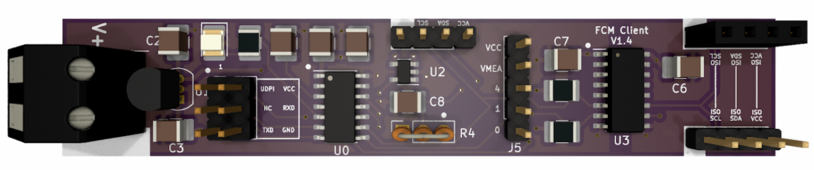
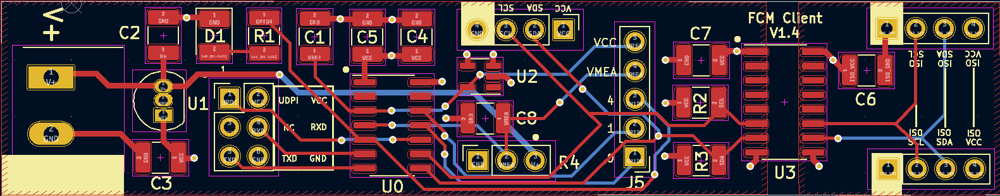
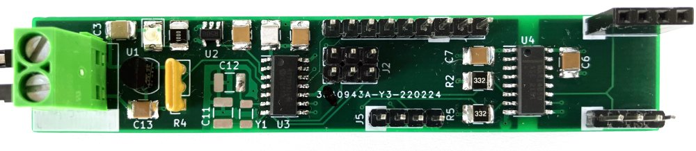
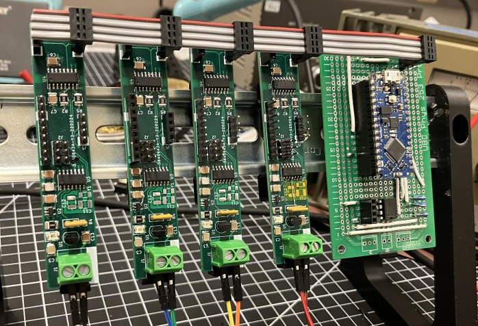

# fuel_cell_monitor
[school] a sponsored capstone project to design a low-cost, scalable, voltage monitoring system that was capable of measuring a wide voltage range

here are some cool pics (i designed, manufactured, and tested the module).

you can read about the design in the included report [here](https://github.com/nullcline/fuel_cell_monitor/blob/main/design_report.pdf) 
